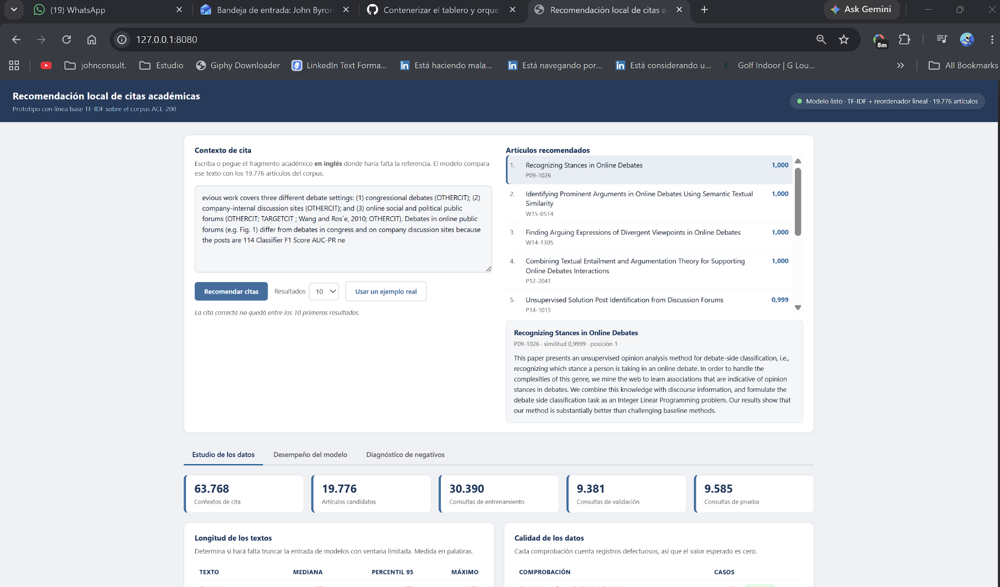

# Manual de usuario
## Sistema de recomendación local de citas académicas

### 1. Objetivo del sistema

Este tablero permite recomendar artículos académicos relevantes a partir de un contexto de cita escrito en inglés.

El usuario introduce un fragmento académico donde podría faltar una referencia y el sistema busca, entre los 19.776 artículos candidatos del corpus, aquellos que considera más pertinentes para ese contexto.

El sistema utiliza una arquitectura de dos etapas:

1. Un recuperador TF-IDF obtiene los artículos candidatos más relacionados léxicamente con el contexto.
2. Un reordenador lineal vuelve a ordenar esos candidatos y asigna un puntaje de relevancia.

El resultado final se presenta como un ranking de artículos recomendados.

---

### 2. Acceso al tablero

Cuando la aplicación se ejecuta mediante Docker Compose, el tablero está disponible en:

```text
http://127.0.0.1:8080
```

En la parte superior derecha de la interfaz aparece el estado del modelo.

Cuando el sistema está preparado para realizar recomendaciones se muestra un mensaje similar a:

```text
Modelo listo · TF-IDF + reordenador lineal · 19.776 artículos
```

Si el backend todavía se está iniciando, el tablero puede mostrar temporalmente un estado de conexión o carga.

---

### 3. Elementos principales de la interfaz

#### 3.1. Contexto de cita

El área titulada "Contexto de cita" permite escribir o pegar el fragmento académico para el cual se desea encontrar una referencia.

El texto debe estar escrito en inglés, ya que el corpus y el modelo utilizado en el prototipo fueron preparados para este idioma.

Ejemplo:

```text
Recent work on neural machine translation has shown that attention mechanisms substantially improve alignment quality.
```

#### 3.2. Botón "Recomendar citas"

Después de escribir el contexto, el usuario debe pulsar:

```text
Recomendar citas
```

El tablero envía el texto al modelo y muestra los artículos recomendados en el panel derecho.

Mientras se procesa la consulta, la interfaz informa al usuario que el modelo está siendo consultado.

#### 3.3. Selector "Resultados"

El selector permite definir cuántos artículos se quieren visualizar.

Las opciones disponibles son:

- 5 resultados
- 10 resultados
- 20 resultados

Por defecto se muestran 10 recomendaciones.

#### 3.4. Botón "Usar un ejemplo real"

El botón:

```text
Usar un ejemplo real
```

carga automáticamente un contexto tomado del corpus de evaluación.

Este modo es útil para probar el funcionamiento del sistema porque el tablero conoce cuál es la cita correcta asociada a ese ejemplo.

Después de ejecutar la recomendación, el sistema indica si la cita correcta apareció dentro de los primeros resultados y en qué posición.

---

### 4. Artículos recomendados

Después de realizar una consulta, el panel "Artículos recomendados" muestra un ranking ordenado.

Cada resultado incluye:

- posición en el ranking;
- título del artículo;
- identificador del artículo (`paper_id`);
- puntaje de relevancia.

Los resultados aparecen ordenados desde el artículo considerado más relevante hasta el menos relevante dentro del número de resultados solicitado.

Al seleccionar un artículo de la lista, en la parte inferior se muestra información adicional:

- título;
- identificador;
- puntaje;
- posición;
- resumen del artículo.

El primer resultado se selecciona automáticamente.

---

### 5. Interpretación del puntaje de relevancia

El valor mostrado junto a cada recomendación corresponde al campo `similitud` producido por el modelo.

En la implementación actual, este valor corresponde a la probabilidad estimada por el reordenador lineal para el artículo candidato.

Un valor más alto indica que el modelo considera que ese artículo tiene mayor relevancia para el contexto consultado.

Por ejemplo:

```text
0,950
```

representa una puntuación mayor que:

```text
0,720
```

por lo que el primer artículo sería ubicado antes en el ranking.

Este puntaje debe interpretarse como una medida utilizada por el modelo para ordenar los candidatos y no como una garantía de que el artículo sea necesariamente la referencia correcta.

El sistema también calcula internamente `similitud_tfidf`, correspondiente a la similitud coseno utilizada por la primera etapa de recuperación. Sin embargo, el tablero presenta principalmente el puntaje final del reordenador.

---

### 6. Identificación de la cita correcta

Cuando se utiliza un ejemplo real, el sistema conoce cuál es el artículo citado originalmente.

Si dicho artículo aparece dentro del ranking mostrado:

- se resalta visualmente;
- aparece una marca de verificación;
- se muestra el texto "cita correcta";
- se informa la posición obtenida.

Ejemplo:

```text
La cita correcta apareció en la posición 5.
```

Si no aparece dentro del número de resultados seleccionado, se muestra un mensaje similar a:

```text
La cita correcta no quedó entre los 10 primeros resultados.
```

Esto no representa un error de funcionamiento del sistema. Significa que, para esa consulta concreta, el modelo no logró ubicar la referencia correcta dentro del Top-K seleccionado.

---

### 7. Ejemplo completo de uso

La siguiente imagen muestra una consulta real ejecutada desde el tablero contenerizado mediante Docker Compose.



Para reproducir este flujo:

1. Abrir el tablero.
2. Pulsar "Usar un ejemplo real".
3. Seleccionar el número de resultados deseado.
4. Pulsar "Recomendar citas".
5. Revisar el ranking obtenido.
6. Seleccionar cualquiera de los artículos para consultar su resumen.
7. Observar si la cita correcta apareció dentro del ranking.

---

### 8. Panel "Estudio de los datos"

La pestaña "Estudio de los datos" presenta información descriptiva sobre el corpus utilizado por el sistema.

Entre los indicadores principales se muestran:

- cantidad de contextos de cita;
- número de artículos candidatos;
- consultas de entrenamiento;
- consultas de validación;
- consultas de prueba.

También contiene análisis de:

- longitud de los textos;
- calidad de los datos;
- integridad de las particiones;
- términos más frecuentes;
- señal léxica entre citas reales y artículos aleatorios;
- artículos más citados.

Este panel permite comprender las características del conjunto de datos utilizado para construir y evaluar el modelo.

---

### 9. Panel "Desempeño del modelo"

La pestaña "Desempeño del modelo" presenta las métricas utilizadas para evaluar la calidad del ranking.

Las principales métricas son:

#### Recall@K

Indica la proporción de consultas en las que el artículo correcto aparece dentro de los primeros K resultados.

Por ejemplo, Recall@10 mide cuántas veces la referencia correcta aparece entre las primeras diez recomendaciones.

#### MRR@K

El Mean Reciprocal Rank considera no solamente si la cita correcta aparece, sino también qué tan arriba se encuentra.

Una referencia correcta situada en la primera posición contribuye más al MRR que una situada en posiciones inferiores.

El tablero permite observar estas métricas para distintas profundidades del ranking.

---

### 10. Panel "Diagnóstico de negativos"

La pestaña "Diagnóstico de negativos" muestra información utilizada durante el desarrollo experimental del reordenador.

Se comparan tres tipos de artículos:

- artículo citado correctamente;
- negativos aleatorios;
- negativos duros obtenidos del Top-100 del recuperador.

El panel permite observar:

- similitud media con la consulta;
- separabilidad entre positivos y negativos;
- comportamiento de las diferentes estrategias de generación de negativos.

Este análisis fue utilizado para comparar las variantes experimentales del modelo.

---

### 11. Mensajes de carga y error

El tablero informa al usuario sobre diferentes situaciones.

Si se intenta realizar una recomendación sin ingresar texto:

```text
Escriba un contexto antes de pedir recomendaciones.
```

Durante una consulta:

```text
Consultando el modelo…
```

Si ocurre un problema de comunicación con el backend, el sistema muestra un mensaje indicando que no fue posible obtener la recomendación.

Si el modelo no encuentra resultados, la interfaz también informa esta situación.

---

### 12. Recomendaciones de uso

Para obtener resultados más útiles:

- utilizar contextos académicos en inglés;
- introducir uno o varios enunciados relacionados con el tema de la posible cita;
- evitar consultas extremadamente cortas o compuestas únicamente por palabras aisladas;
- revisar varios resultados y no únicamente el primero;
- utilizar el resumen de los artículos para comprobar su pertinencia;
- interpretar el puntaje como una señal de ranking y no como una garantía absoluta.

---

### 13. Alcance del prototipo

El tablero corresponde a un prototipo académico de recomendación local de citas.

El modelo trabaja únicamente con los artículos incluidos en el corpus disponible. Por lo tanto:

- no busca artículos nuevos en Internet;
- no garantiza que la referencia correcta siempre aparezca en el Top-K;
- no sustituye la revisión académica realizada por el usuario;
- sus resultados dependen del corpus y del modelo entrenado.

Su propósito es apoyar la exploración de posibles referencias académicas a partir del contexto textual de una cita.